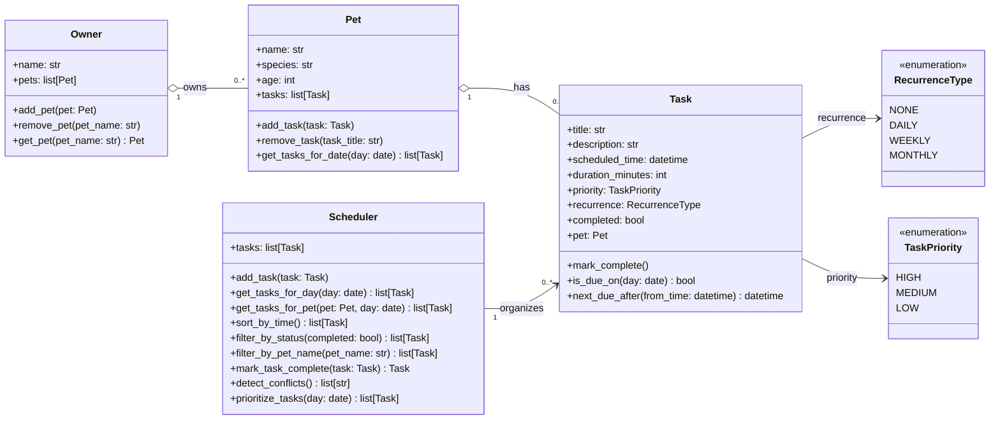

```mermaid
classDiagram
    direction LR

    class Owner {
        +name: str
        +pets: list[Pet]
        +add_pet(pet: Pet)
        +remove_pet(pet_name: str)
        +get_pet(pet_name: str) Pet
    }

    class Pet {
        +name: str
        +species: str
        +age: int
        +tasks: list[Task]
        +add_task(task: Task)
        +remove_task(task_title: str)
        +get_tasks_for_date(day: date) list[Task]
    }

    class Task {
        +title: str
        +description: str
        +scheduled_time: datetime
        +duration_minutes: int
        +priority: TaskPriority
        +recurrence: RecurrenceType
        +completed: bool
        +pet: Pet
        +mark_complete()
        +is_due_on(day: date) bool
        +next_due_after(from_time: datetime) datetime
    }

    class Scheduler {
        +tasks: list[Task]
        +add_task(task: Task)
        +get_tasks_for_day(day: date) list[Task]
        +get_tasks_for_pet(pet: Pet, day: date) list[Task]
        +sort_by_time() list[Task]
        +filter_by_status(completed: bool) list[Task]
        +filter_by_pet_name(pet_name: str) list[Task]
        +mark_task_complete(task: Task) Task
        +detect_conflicts() list[str]
        +prioritize_tasks(day: date) list[Task]
    }

    class RecurrenceType {
        <<enumeration>>
        NONE
        DAILY
        WEEKLY
        MONTHLY
    }

    class TaskPriority {
        <<enumeration>>
        HIGH
        MEDIUM
        LOW
    }

    Owner "1" o-- "0..*" Pet : owns
    Pet "1" o-- "0..*" Task : has
    Task --> RecurrenceType : recurrence
    Task --> TaskPriority : priority
    Scheduler "1" --> "0..*" Task : organizes
```
